# Healthy Recipe Journal RAG App

## Topic
Healthy recipes and food habits built from a personal fitness-journal journey.

## Project goal
This project is a topic-based RAG web app built with:

- Amazon Bedrock Knowledge Base
- Flask
- `boto3`
- Docker
- EC2 deployment

The app lets a user ask food and recipe questions through a themed web interface and returns answers from an Amazon Bedrock Knowledge Base.

## Documents used
The project uses a small but meaningful recipe set stored locally in `data/` and uploaded to S3 for Bedrock ingestion:

- `01_protein_pancakes_with_berries.txt`
- `02_go_pro_yogurt_strawberry_cottage_bowl.txt`
- `03_strawberry_protein_pastry.txt`
- `04_beet_feta_walnut_raspberry_salad.txt`
- `05_high_protein_poke_bowl.txt`
- `06_mango_protein_yogurt_bowl.txt`
- `07_protein_energy_balls.txt`
- `10_high_protein_ingredients_guide.txt`
- `11_seafood_tomato_stew_with_fries.txt`
- `12_tuna_green_salad.txt`
- `17_baked_lemon_salmon.txt`

Important:
The Flask app does not read these files directly at runtime. The documents are uploaded to S3, connected to an Amazon Bedrock Knowledge Base, synced, and then queried through Bedrock.

## How the app works
1. The user opens the Flask web page.
2. The user types a question about healthy recipes, meal ideas, or food habits.
3. Flask sends the question to Amazon Bedrock with `boto3` using Knowledge Base `retrieve_and_generate`.
4. Bedrock retrieves the relevant chunks from the synced recipe documents.
5. A generated answer is shown in the chat UI with its Bedrock source references.

## Main implementation notes
- Chat history is stored server-side under `instance/chat_sessions/`.
- A new browser session resets the saved chat state automatically.
- The message form submits asynchronously, so the user message appears immediately and the page does not fully refresh while waiting for the answer.
- The broken related follow-up buttons were removed from the UI.
- The app supports `BEDROCK_MODEL_ID` or `BEDROCK_MODEL_ARN`.

## Required environment variables
Set these before running the app:

- `FLASK_SECRET_KEY`
- `AWS_REGION`
- `BEDROCK_KNOWLEDGE_BASE_ID`
- `BEDROCK_MODEL_ID` or `BEDROCK_MODEL_ARN`

Recommended values for this project:

- `AWS_REGION=us-east-1`
- `BEDROCK_MODEL_ID=global.anthropic.claude-haiku-4-5-20251001-v1:0`

## Run locally
Install dependencies:

```bash
pip install -r requirements.txt
```

Run the app:

```bash
export FLASK_SECRET_KEY=change-me
export AWS_REGION=us-east-1
export BEDROCK_KNOWLEDGE_BASE_ID=your-kb-id
export BEDROCK_MODEL_ID=global.anthropic.claude-haiku-4-5-20251001-v1:0
python app.py
```

On Windows PowerShell:

```powershell
$env:FLASK_SECRET_KEY="change-me"
$env:AWS_REGION="us-east-1"
$env:BEDROCK_KNOWLEDGE_BASE_ID="your-kb-id"
$env:BEDROCK_MODEL_ID="global.anthropic.claude-haiku-4-5-20251001-v1:0"
python app.py
```

Open:

```text
http://localhost:5000
```

## Docker
Build:

```bash
docker build -t healthy-recipe-journal .
```

Run:

```bash
docker run -p 5000:5000 \
  -e FLASK_SECRET_KEY=change-me \
  -e AWS_REGION=us-east-1 \
  -e BEDROCK_KNOWLEDGE_BASE_ID=your-kb-id \
  -e BEDROCK_MODEL_ID=global.anthropic.claude-haiku-4-5-20251001-v1:0 \
  healthy-recipe-journal
```

The container runs with `gunicorn` for a safer demo deployment path.

## EC2 deployment summary
The deployment flow used for this submission was:

1. Launch an Ubuntu EC2 instance.
2. Open inbound `SSH` from `My IP`.
3. Open inbound `Custom TCP 5000` from `0.0.0.0/0`.
4. Connect with SSH using the `.pem` key pair.
5. Install Docker on EC2.
6. Copy `app.py`, `Dockerfile`, `requirements.txt`, `templates/`, and `static/` to EC2.
7. Build the Docker image on EC2.
8. Run the container on EC2 with AWS credentials and `AWS_REGION=us-east-1`.
9. Open the app through the EC2 public IP and test with a real question.

## Public test URL / IP
Public URL used during testing:

```text
http://23.21.9.140:5000
```

## Screenshots and demo
### 1. S3 upload completed
The recipe documents were uploaded successfully to the S3 bucket path used by Bedrock.

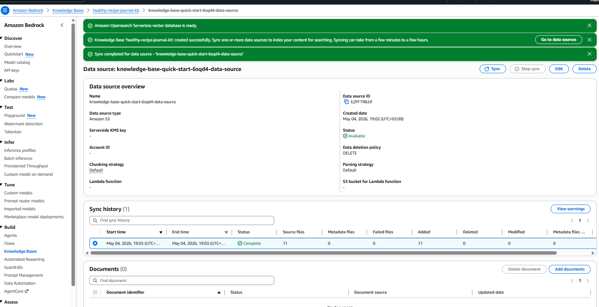

### 2. S3 bucket contents
This shows the final `healthy-recipes/` folder with the 11 uploaded text documents.

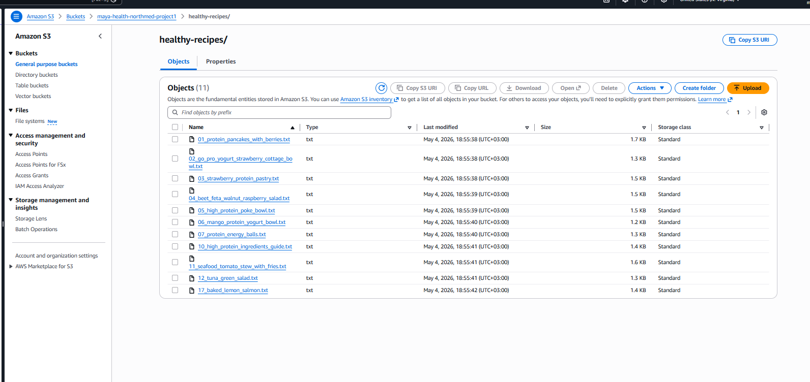

### 3. Bedrock vector store setup
This is the Knowledge Base storage configuration page using `Titan Text Embeddings v2` and `Amazon OpenSearch Serverless`.

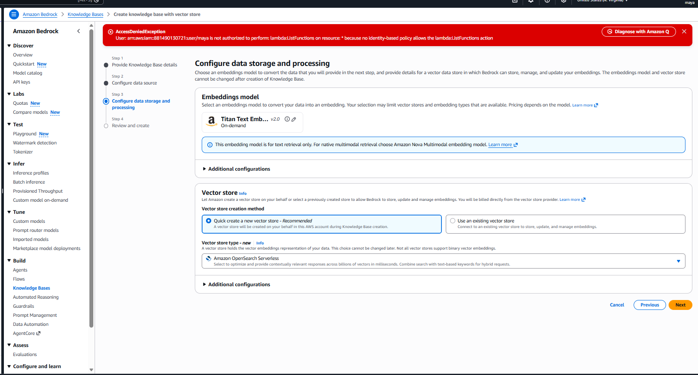

### 4. Knowledge Base overview
This is the created `healthy-recipe-journal-kb` overview page in Amazon Bedrock.

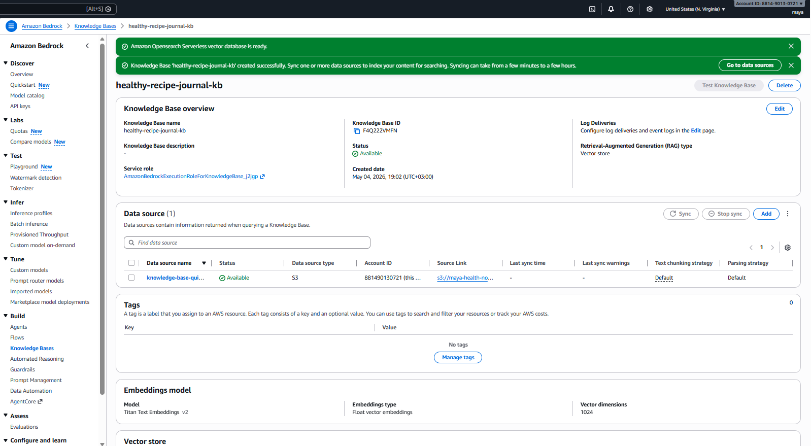

### 5. Data source sync completed
This shows the data source attached to the Knowledge Base and the successful sync result for the 11 recipe files.

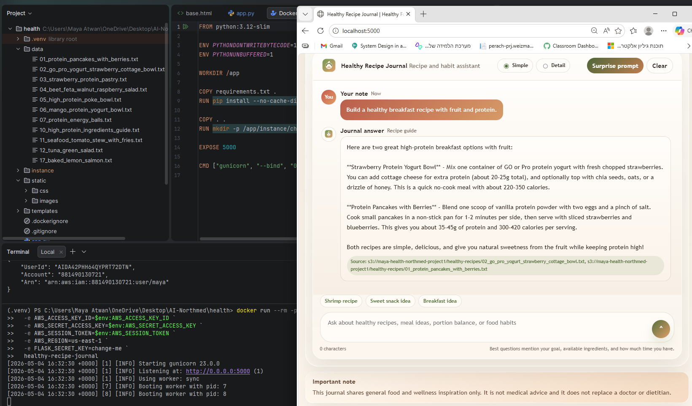

### 6. Knowledge Base retrieval test
This screenshot shows Bedrock retrieving the relevant recipe chunks for `tuna green salad`.

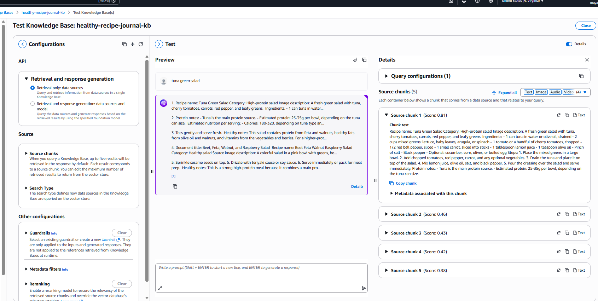

### 7. Knowledge Base generated answer
This screenshot shows Bedrock successfully generating an answer from the synced recipe content.

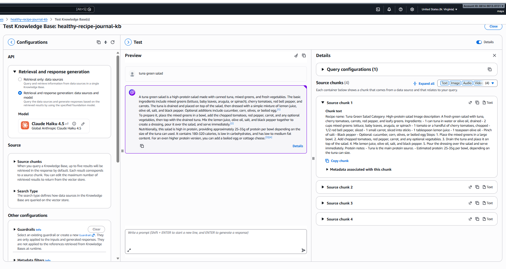

### 8. Themed homepage
The app theme is aligned to the chosen topic with healthy-meal visuals and recipe-journal styling.

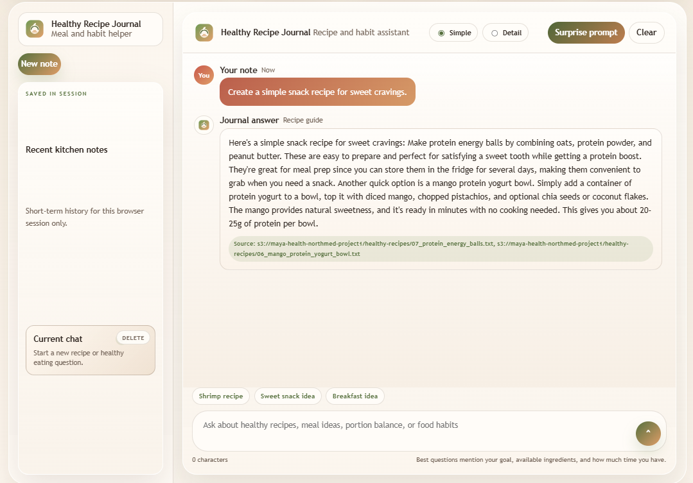

### 9. Local Flask app answer
This local test shows the app answering a high-protein breakfast question.

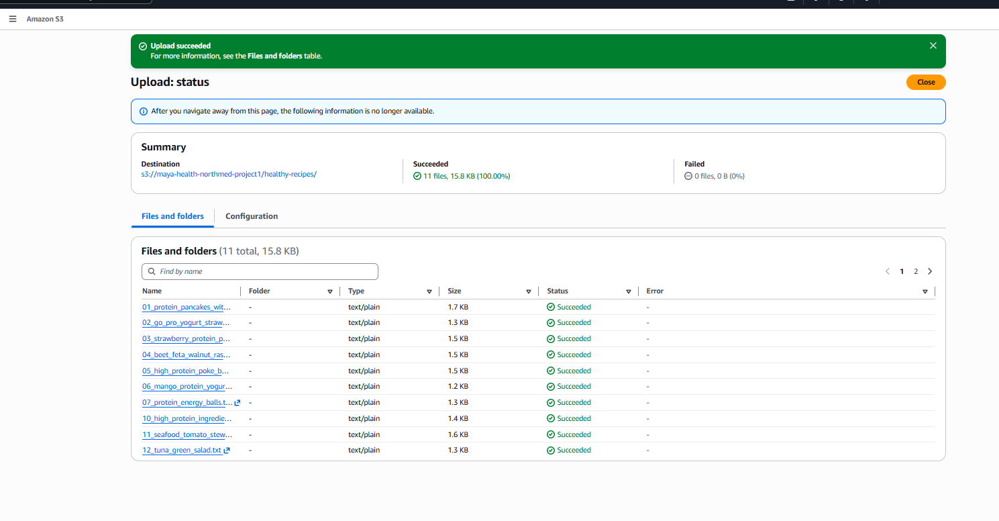

### 10. Local recipe answer example
This local test shows a seafood tomato stew with shrimp answer generated from the knowledge base.

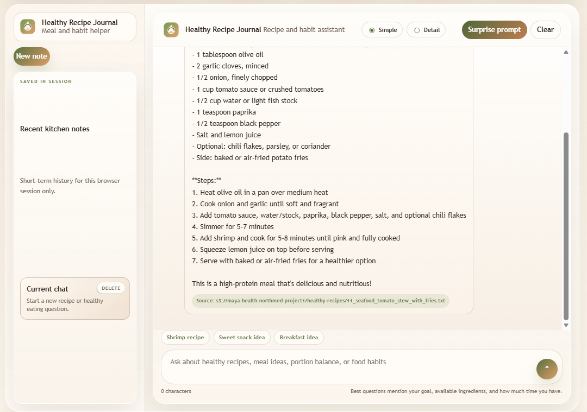

### 11. Local snack answer example
This local test shows a sweet snack answer using the energy-balls and mango-yogurt recipe documents.


### 12. Docker container running locally
This `docker ps` screenshot shows the `healthy-recipe-journal` container running locally on port `5000`.

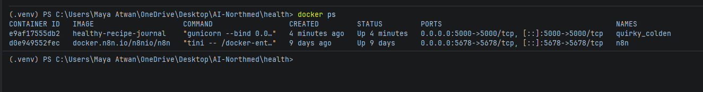

### 13. EC2 instance details
This is the EC2 instance used for the public deployment.

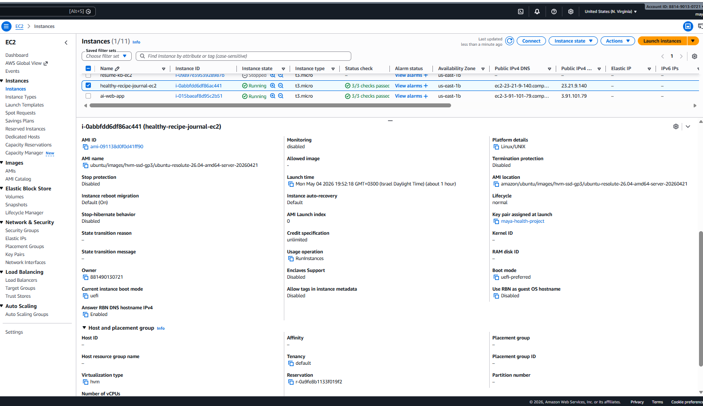

### 14. Public EC2 app with real answer
This screenshot proves the app was publicly accessible from the EC2 public IP and returned a real recipe answer.

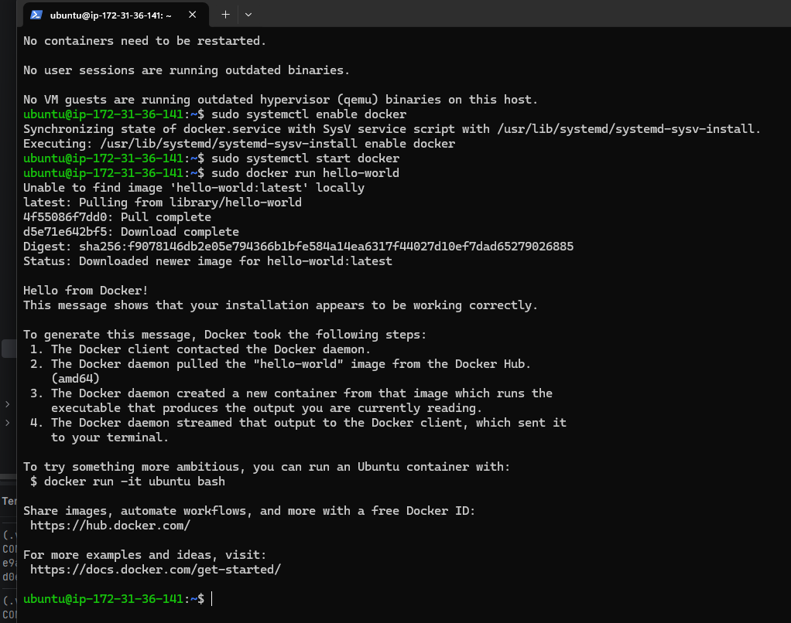

### 15. Demo recording
A short browser recording of the public deployment is included here:

[Public EC2 demo recording](docs/screenshots/15-public-ec2-demo-recording.mp4)

## Cleanup note
After testing and screenshots were completed, the temporary AWS resources were deleted.

- Deleted EC2 instance: `healthy-recipe-journal-ec2`
- Deleted Bedrock-related temporary resources: `healthy-recipe-journal-kb` and its OpenSearch Serverless vector collection
- Deleted storage used for the demo: S3 bucket `maya-health-northmed-project1`
- Deleted temporary programmatic access: the IAM access key created for the deployment test

## Submission note
This project demonstrates the required chain clearly:

`documents -> S3 -> Bedrock Knowledge Base -> Flask app with boto3 -> Docker -> EC2 public access -> cleanup`
